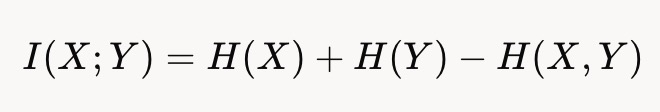
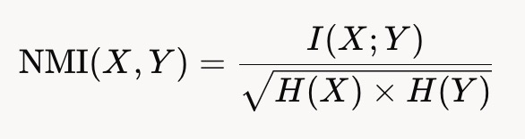
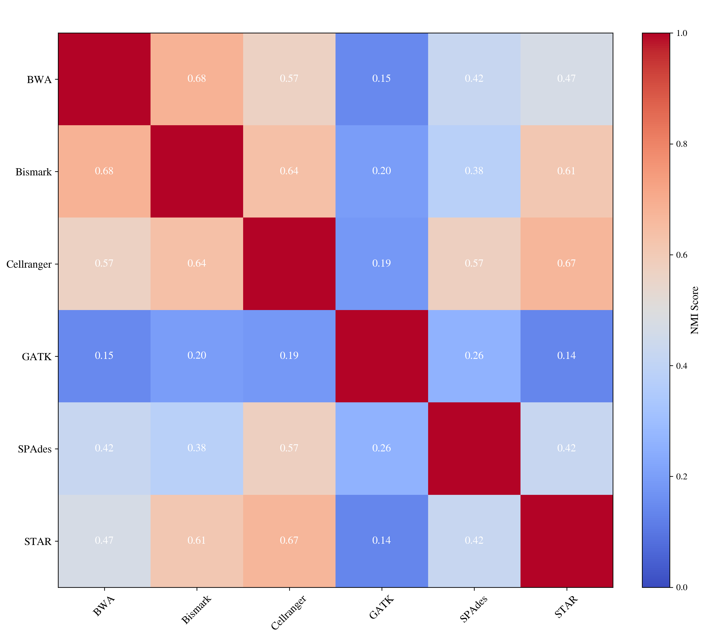

# 不同计算软件资源需求特征相似性热图绘制工具

## 简介

本项目是一个基于Python的互信息计算和热图绘制工具，用于比较不同计算软件资源需求特征的相似性（包括但不限于CPU使用率、内存使用量、IO读写速率、功耗）并使用直观的热图来展示。它使用`matplotlib`库来绘制热图，并提供了多种配置选项，包括颜色、标签、数据点等。用户可以根据自己的需求，自定义热图的样式和内容。


## 归一化互信息计算方法
互信息（MI）是信息论中的一个核心概念，用于衡量两个随机变量之间的相互依赖程度。具体来说，它量化了通过观察一个变量可以减少关于另一个变量的不确定性程度。对于两个随机变量X和Y，互信息的定义为：  

其中，H(X)和H(Y)分别是X和Y的熵，H(X,Y)是它们的联合熵。H(X,Y)衡量了变量X的不确定性，通常通过概率分布计算。
	然而，互信息的值范围没有上限，取决于变量的熵，这使得不同变量对之间的直接比较困难。因此，我们引入了归一化互信息（NMI）来标准化这一度量。NMI将MI缩放到0到1的范围，便于比较。通常较为常用的归一化方式为几何平均归一化，即：  

其中，H(X)和H(Y)分别是X和Y的熵，I(X;Y)是它们的互信息。NMI=0表示两个变量之间完全独立，没有共享信息；NMI=1表示两个变量之间完全相同，共享信息量最大。

我们使用归一化互信息来衡量计算软件两两之间的资源需求特征相似性，整体计算方式如下：
1.	数据收集：通过监控软件，使用相同的采集间隔（1秒），记录每款软件在实际计算运行期间的各项指标数据。
2.	动态时间规整（DTW）对齐：由于每个软件运行时间不同，所以采集的指标数据长度不同。DTW用于对齐可能长度不同或时间节奏不同的两个时间序列，使它们的模式能够进行有意义的比较。我们使用DTW算法对不同软件运行的资源使用时间序列进行对齐。
3.	连续数据离散化：为了使时间序列这样的连续数据适合NMI的离散计算方法，采用离散化的方式将连续数值数据离散化为10个区间（分箱）。离散化后可以捕捉数据的分布特征，同时减少噪声影响。
4.	每指标NMI计算：计算每两个计算软件之间同一指标的互信息，然后使用上述NMI公式进行标准化。
5.	平均相似性得分：将每两个计算软件的所有指标的NMI值取平均，得到两款软件之间的总体资源需求特征相似性得分。得分范围为0到1，1表示完全相似，0表示完全不相关。
6.	可视化：使用热图展示所有两两软件之间的相似性得分。热图的行和列对应于不同的软件，每个单元格的颜色表示对应的两个计算软件的资源需求特征相似性。


## 使用方法

1. 安装依赖库
   - numpy
   - sklearn
   - dtaidistance
   - matplotlib

2. 运行脚本

   在自己的Python脚本中导入函数：

   ```python
   from nmi_heatmap import calculate_and_plot_nmi_heatmap
   ```

   读取每个计算软件监控文件中的数据，分别将每一帧监控的CPU使用率、内存使用量（单位GB）、文件系统接收带宽（IO读带宽，单位GB）、文件系统发送带宽（IO写带宽，单位GB）、功耗（单位W）以及对应的软件名称整理到字典中。列表中元素格式应为整型或浮点数，形如：
   ```python
   data_dict = {'cpu': {'BWA': [10,20,30,...],
                        'Bismark': [10,20,30,...],
                        'Cellranger':[10,20,30,...],
                        'GATK':[10,20,30,...],
                        'SPAdes':[10,20,30,...],
                        'STAR':[10,20,30,...]},
                'ram': {'BWA': [10,20,30,...],
                        'Bismark': [10,20,30,...],
                        'Cellranger':[10,20,30,...],
                        'GATK':[10,20,30,...],
                        'SPAdes':[10,20,30,...],
                        'STAR':[10,20,30,...]},
                'pfs_recv': {'BWA': [10,20,30,...],
                            'Bismark': [10,20,30,...],
                            'Cellranger':[10,20,30,...],
                            'GATK':[10,20,30,...],
                            'SPAdes':[10,20,30,...],
                            'STAR':[10,20,30,...]},
                'pfs_send': {'BWA': [10,20,30,...],
                            'Bismark': [10,20,30,...],
                            'Cellranger':[10,20,30,...],
                            'GATK':[10,20,30,...],
                            'SPAdes':[10,20,30,...],
                            'STAR':[10,20,30,...]},
                'power': {'BWA': [10,20,30,...],
                        'Bismark': [10,20,30,...],
                        'Cellranger':[10,20,30,...],
                        'GATK':[10,20,30,...],
                        'SPAdes':[10,20,30,...],
                        'STAR':[10,20,30,...]}}
   ```
   然后调用函数计算互信息并绘制热图，将上述列表作为参数传递给函数：

   ```python
   metrics, combined_nmi = calculate_and_plot_nmi_heatmap(softwares, data_dict, output_path)
   ```
   参数说明：
   - softwares：所有计算软件名称的列表，例如：`["BWA", "Bismark", "Cellranger", "GATK", "SPAdes", "STAR"]`
   - data_dict：上述汇总的所有软件所有指标的字典
   - output_path：图片保存路径，包括文件名和后缀名，例如：`"./example.png"`  

## 示例
直接执行以下命令：
```bash
python nmi_heatmap.py
```
将读取mon/目录下的监控数据文件，计算互信息并绘制热图，保存到software_nmi_heatmap.png文件中。

## 示例图片

